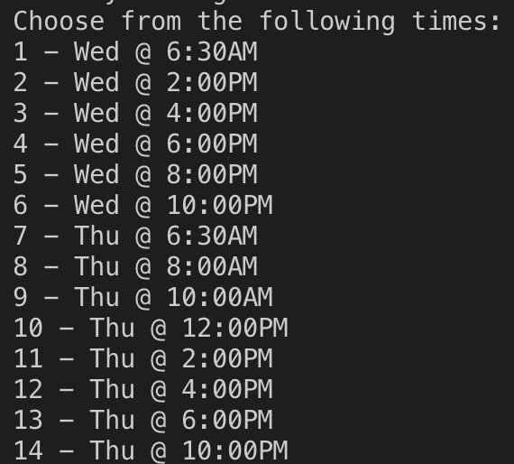

# Welcome to the GeeGeeRegFiller

## What does it do?

Looks through the geegeereg website for available gym slots, providing an easy select menu to book ✅

(Only Supports Minto Gym at the moment)🚨



## What Do I need to use it?

You will need the following:

- Python
- pip
- Selenium
- ChromeWebDriver
- Latest Chrome Broweser version

## Installation instructions (Mac)

### pip

In terminal type:

```
python3 get-pip.py
```

### Selenium

In terminal type:

```
pip3 install -U selenium
```

### Chrome Driver Install (With Brew)

```
brew install --cask chromedriver
```

### Chrome Driver Install (Without Brew)

Go to the following website and download the correct version for your mac

<https://chromedriver.storage.googleapis.com/index.html?path=100.0.4896.20/>

Then simply unpack the folder and run the bash inside

## How to Use

Run the python script using the terminal/cmd

```
python3 GeeGeeRegFiller.py
```

Follow the terminal instructions and enjoy working out!

## Common problems and fixes
